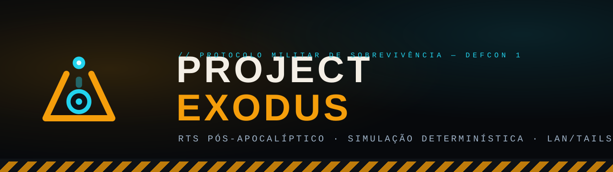
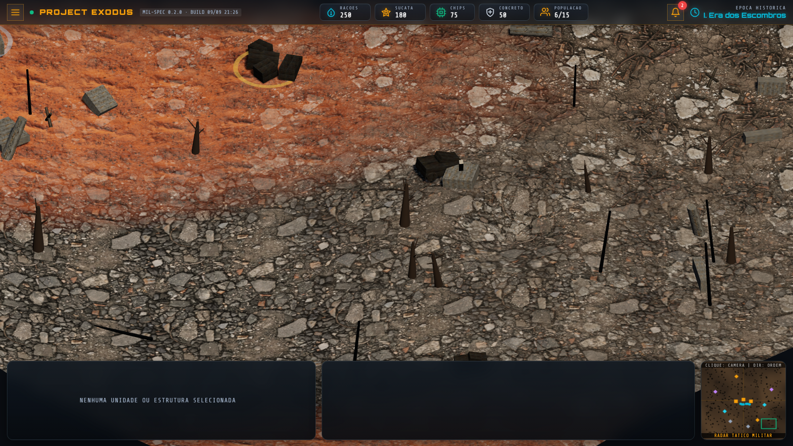
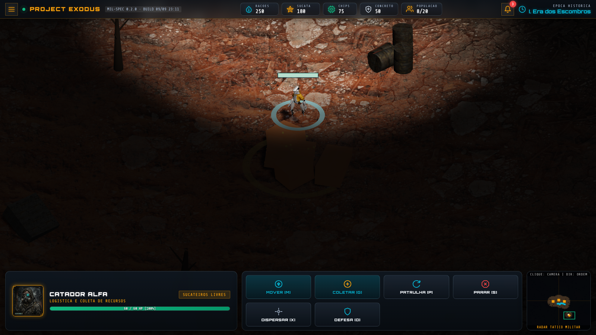
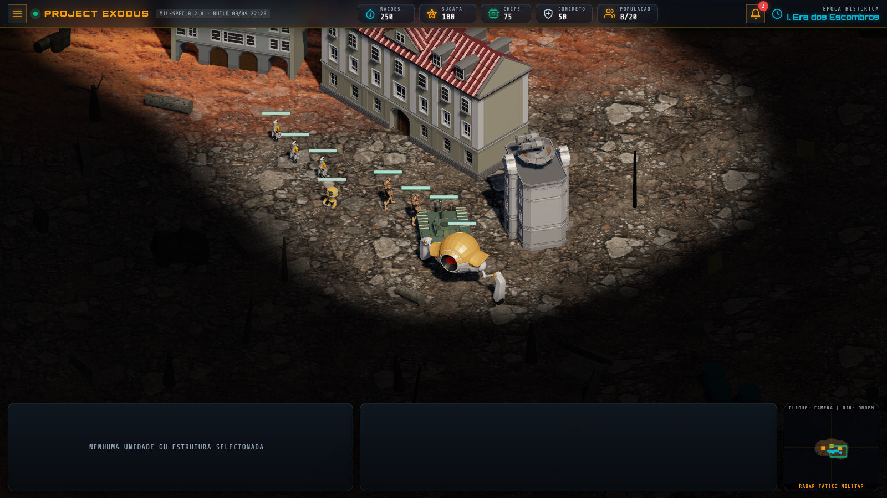
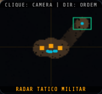

<div align="center">



**Browser-based post-apocalyptic RTS. Deterministic 20 Hz simulation. LAN/Tailscale multiplayer.**

[](LICENSE)
[](https://www.typescriptlang.org/)
[](https://threejs.org/)
[](https://vitejs.dev/)
[](https://nodejs.org/)
[](CONTRIBUTING.md)
[](roadmap.md)

[Português](README.md) · **English**

</div>

---

The rebel AIs fell — and took the world with them. In Year 47 PC (Post-Collapse), humanity
starts over from a technological stone age: dismantling drones by hand, praying to dead
antennas, melting down the past to forge the next step.

**Project Exodus is a browser RTS** built on *Age of Empires 2* mechanics (economy, ages,
base building) with *StarCraft* asymmetry (three distinct factions), rendered with Three.js —
nothing to install.

The real differentiator is under the hood: an **authoritative deterministic server** (20 Hz,
fixed tick, seeded RNG, custom A*) designed for **LAN and Tailscale** matches.
No cloud. No matchmaking. No telemetry. Local-first by choice.

> **Honest status:** playable vertical slice. Economy, gathering, training, fog of war,
> camera, selection and HUD work end-to-end; **combat, playable ages and multiplayer
> arrive in phases 4–5**. See the [roadmap](roadmap.md).

## See it

| Base and living scenery | Living mining |
| :---: | :---: |
|  |  |
| **Articulated tank turning** | **Fog of War + minimap** |
|  |  |

Full HUD on desktop and mobile: [shots 07–16](tools/visual-check/shots/) ·
Visual measurements in [`tools/visual-check/`](tools/visual-check/).

## Run locally

Requirements: **Node.js 22+** and npm.

```bash
git clone https://github.com/rabelojunior81-collab/project-exodus.git
cd project-exodus
npm install          # installs the 3 workspaces
npm run dev:client   # opens http://localhost:5173
```

Authoritative server (it exists and is tested; the client does not talk to it yet — phase 2.6):

```bash
npm run dev:server   # WebSocket on ws://localhost:8080
npm test             # 39 simulation asserts
```

## What is playable today

- Full isometric RTS camera (pan, edge pan, zoom 9–110, rotation, clickable minimap);
- Single and box selection with tactical priority; Move / Stop / Patrol / Rally / Disperse orders;
- Economy loop: 8 resource nodes, 4-stage depletion gathering, delivery at the Command Center;
- Training of 5 units with cost, time, queue, population (20) and refund on cancel;
- Client-side Fog of War (90×90 grid), desktop/mobile HUD, PT-BR audio buses;
- Deterministic procedural scenery (365 instanced props, fixed seed) and 9 animated GLTF models.

**Not playable yet:** combat, player construction, age transitions, victory conditions and
multiplayer. The deterministic server exists and passes 65 asserts — client↔server
reconciliation is the next phase (2.6). Details and open decisions in
[`docs/specs/02-integracao-cliente-servidor.md`](docs/specs/02-integracao-cliente-servidor.md).

## Under the hood

```text
client/   Three.js 0.174 + Vite 6 + TypeScript — game, HUD and selection
server/   Node + ws — authoritative 20 Hz simulation, A*, worker FSM
tools/    studio-gemini (asset pipeline) + visual-check (Playwright harness)
docs/     specs (SDD) · journal (DDD) · knowledge · media
```

| System | How it works |
| :--- | :--- |
| Simulation | Fixed 50 ms tick, sorted ids, seeded RNG — same seed + same commands = same result (proven by test) |
| Pathfinding | 8-directional A*, deterministic binary heap, crater cost up to 5×, line-of-sight smoothing |
| Economy | 4 resources: Rations/Water, Scrap, AI Chips, Concrete |
| 3D client | Tri-texture splat blending, shader-based fog of war, particles, skeletal animation |
| Assets | Gemini pipeline with `.meta.json` provenance sidecars and preserved masters |

## Audio and narrative

The game ships PT-BR narrated era briefings, per-unit voice lines and ambient music — all
generated by the in-repo pipeline at `tools/studio-gemini`. GitHub does not play audio inline;
listen on the [landing page](landing/) or directly: [`era-1-briefing.mp3`](client/public/assets/audio/era-1-briefing.mp3).

The four-era chronicles live in [`client/public/assets/lore/`](client/public/assets/lore/).

## Roadmap

- [x] **Phase 0–1** — Governance, 3D engine, isometric camera, RTS selection
- [x] **Phase 1.5–1.10** — Real GLTF models, professional HUD, playable economy, audit
- [x] **Phase 1.7** — Living world: dense scenery, fog of war, living mining, Gemini assets
- [ ] **Phase 1.11** — Remediation and hardening (build stamp, manifests, audio, video)
- [ ] **Phase 2.6** — Client↔server reconciliation (`shared/` workspace, parity, snapshots)
- [ ] **Phase 3** — LAN/Tailscale multiplayer
- [ ] **Phase 4** — Ages, reactive narrative, archaeological bunkers
- [ ] **Phase 5** — Combat, asymmetric factions, polish

Full detail in [`roadmap.md`](roadmap.md). The development process (decisions, audits,
post-mortems) is in the open journal at [`docs/journal/`](docs/journal/).

## Contributing

Contributions are welcome. Read [`CONTRIBUTING.md`](CONTRIBUTING.md) and the
[`CODE_OF_CONDUCT.md`](CODE_OF_CONDUCT.md). The essentials:

1. Open an issue before behavioral PRs (small fixes can go straight to a PR);
2. [Conventional Commits](https://www.conventionalcommits.org/);
3. Every PR needs green gates: `npx tsc --noEmit` on all 3 workspaces,
   `npm test` on the server and `node tools/visual-check/test-buttons.mjs`;
4. Never commit keys: `.env` is protected; new assets need a sidecar and a MANIFEST entry;
5. Structural changes update the living documents (`estate.md`, `handoff.md`, journal).

## License

**Code:** [MIT](LICENSE) — use, modify, distribute.
**Assets** (models, portraits, audio, music, lore): their own terms, credits and pending
confirmations in [`LICENSES/ASSETS.md`](LICENSES/ASSETS.md). Base models by
[Quaternius](https://quaternius.com/) (CC0), Mixamo animations (Adobe terms), art and audio
generated by this project's Gemini pipeline.

---

<div align="center">


**Rabelus Lab** · [rabelus.com](https://rabelus.com) · [rabelo.work@gmail.com](mailto:rabelo.work@gmail.com)

*AI-Born Engineer, not merely AI-assisted.*

</div>
